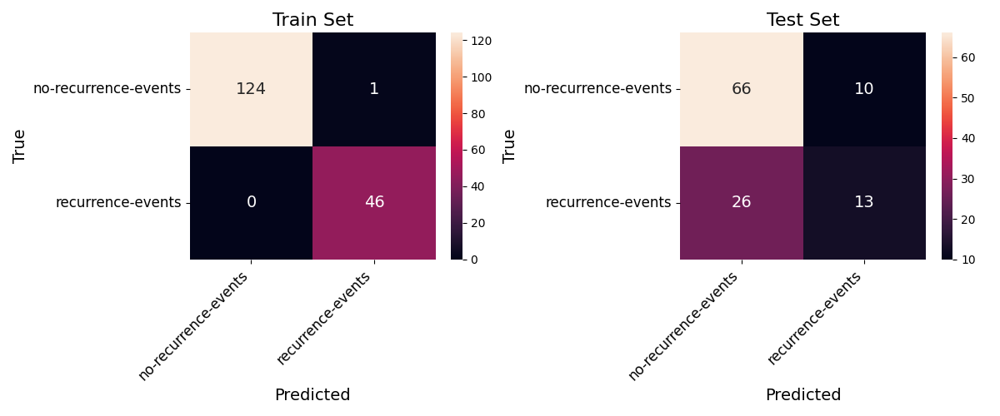
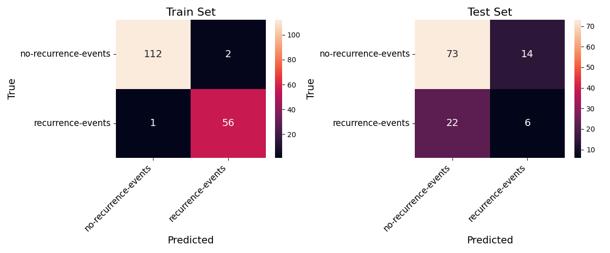
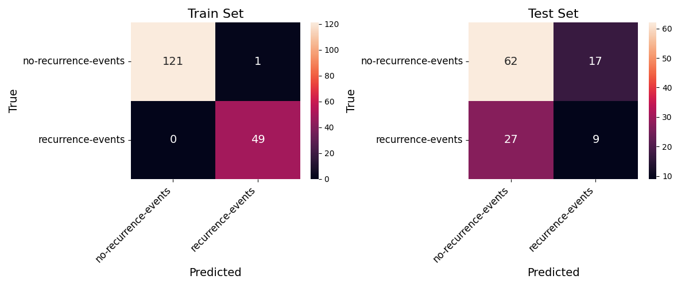
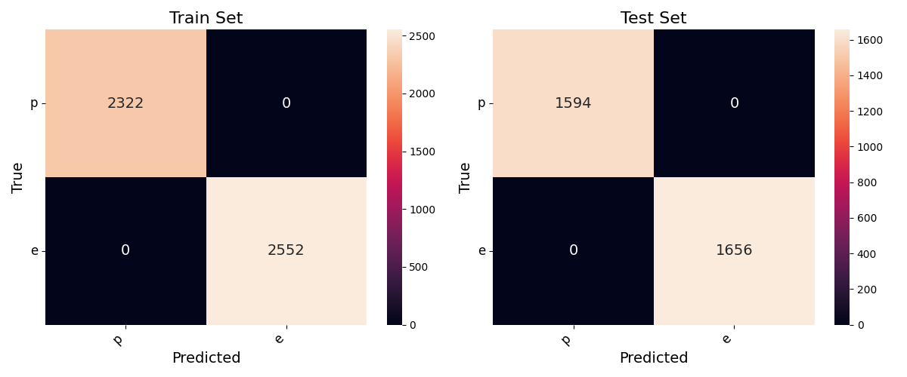
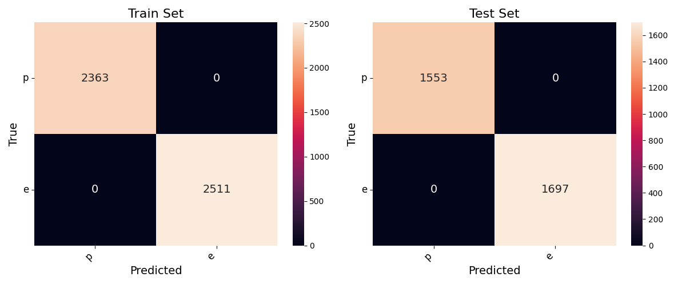
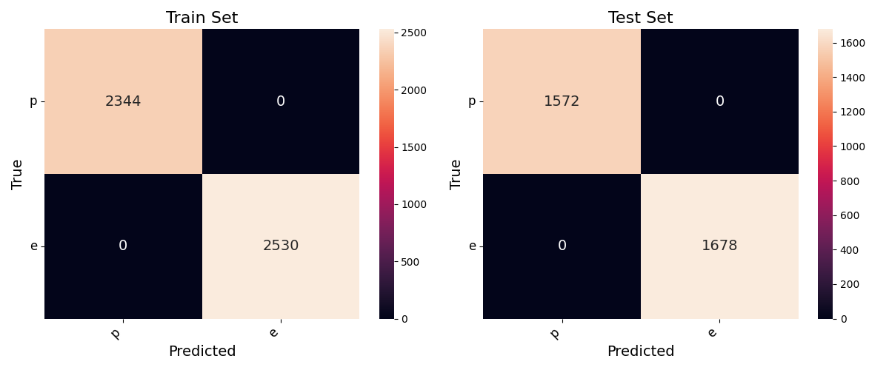

# Sprawozdanie WSI Lab4 Tobiasz Kownacki

------------------------------
------------------------------

## 1. Zadanie

Zaimplementować klasyfikator ID3 (drzewo decyzyjne). Atrybuty nominalne, testy tożsamościowe. Podać dokładność i macierz pomyłek na zbiorach: Breast cancer i mushroom.Dlaczego na jednym zbiorze jest znacznie lepszy wynik niż na drugim? Do potwierdzenia lub odrzucenia postawionych hipotez konieczne może być przeprowadzenie dodatkowych eksperymentów ze zmodyfikowanymi zbiorami danych.

------------------------------

## 2. Zbiór danych Breast-cancer

- Macierze pomyłek dla zbioru treningowego i testowego, które zostały wylosowane z ustalonym ziarnem równym kolejno: 7, 25, 42.

- Wnioski:

 Model na zbiorze Breast Cancer osiąga wyniki które pozostawiają wiele do życzenia. Średnia dokładność na zbiorze testowym wynosi średnio 66%. Powodem jest mała ilość i słaba jakość danych. Model był trenowany na zbiorze składającym się z tylko 171 wierszy. Ponadto zbiór danych składa się z dwóch klas o nierównomiernym rozkładzie wynoszącym 70:30, co skutkuje diametralnym pogorszeniem dokładności predykcji dla klasy mniej licznej. Klasa słabiej reprezentowana ma dokładność wynoszącą średnio tylko 40%. Dodatkowym problemem jest ograniczona liczba atrybutów, wynosząca zaledwie 10.

------------------------------

## 3. Zbiór danych Mushroom

- Macierze pomyłek dla zbioru treningowego i testowego, które zostały wylosowane z ustalonym ziarnem równym kolejno: 7, 25, 42.

- Wnioski:
Model na zbiorze Mushroom osiąga dokładność na poziomie 100%. Zbiór danych Mushroom jest o wiele lepszy od Breast-Cancer. Model był trenowany na około 4800 wierszach i do tego rozkład klas wynosi 50:50. Dodatkowo zbiór danych ma 2 razy większą ilość atrybutów.

------------------------------

## 4. Wnioski

Wyniki ID3 różnią się przez wielkość danych, rozkład klas i liczbę atrybutów. Zbiór Mushroom jest większy, ma równomierny rozkład klas i przez to 100% dokładności. Zbiór Breast Cancer ma mało próbek, nierówny rozkład klas i tylko 10 atrybutów, co pogarsza wyniki. Nierównowaga klas utrudnia przewidywanie klasy mniejszej. Poprawa wymaga zwiększenia danych, zrównoważenia klas i dodania atrybutów.
